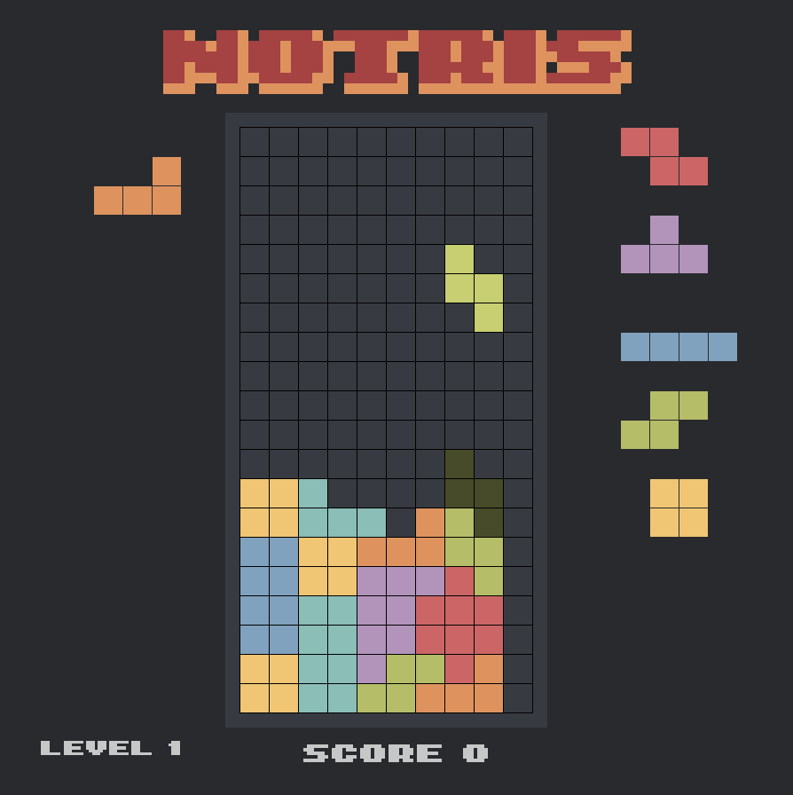

# Notris

This is a quickly put together falling block game made in C++ and SDL as part of my portfolio.

## Features
* All the falling blocks you know and love
* SRS style rotation algorithm (all kicks and spins)
* A settings menu 
* Config persistence
* BGM and SFX using SDL_Mixer
* Font rendering using SDL_TTF

## Wishlist
These are some things I am interested in doing:
* Controller support
* Better handling of window resize (at the moment it uses nearest neighbour scaling, which leads to inconsistent line widths)
* Multiplayer (local or otherwise)